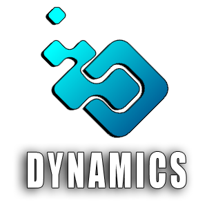
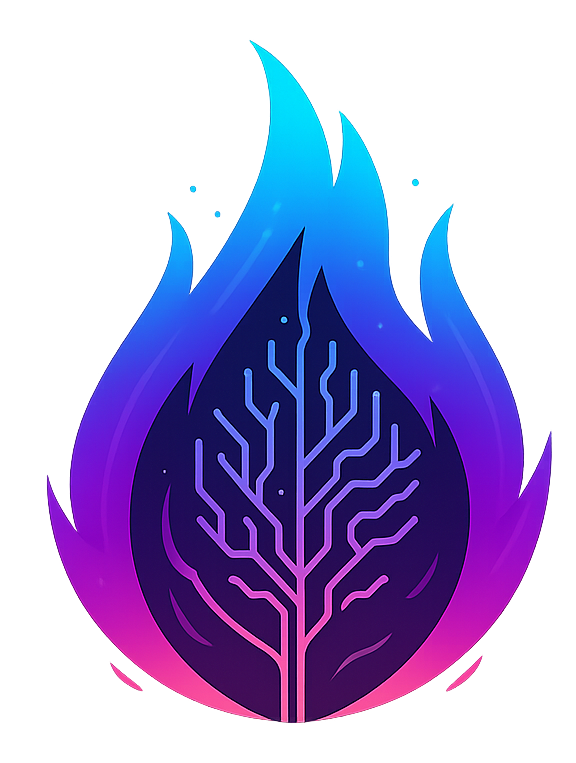

# Rafael Trevizoli

  

## Introdução

Este portfólio reúne os projetos desenvolvidos ao longo da minha formação em Banco de Dados pela [Faculdade de Tecnologia de São José dos Campos - Prof. Jessen Vidal](https://fatecsjc-prd.azurewebsites.net/). Ingressei no curso no segundo semestre de 2022, trazendo uma trajetória prévia na área de desenvolvimento de software, com passagens por diferentes segmentos da indústria.

O curso de Banco de Dados ampliou minha visão técnica, especialmente nas áreas de modelagem de dados, arquitetura de sistemas e desenvolvimento orientado a dados. Ao longo dos semestres, trabalhei com equipes multidisciplinares em projetos reais, aplicando metodologias ágeis e tecnologias variadas para entregar soluções a parceiros acadêmicos.

Atuo principalmente no desenvolvimento backend, com experiência em Java, Python e ambientes containerizados. Tenho familiaridade com bancos de dados relacionais e não relacionais, desenvolvimento de APIs REST e integração de sistemas.

## Meus Principais Conhecimentos

Java e Spring Boot, no desenvolvimento de APIs REST seguras e escaláveis; Python com Django, na construção de backends orientados a dados; Vue.js e TypeScript, no desenvolvimento de interfaces web modernas e componentizadas; PostgreSQL e MySQL, para modelagem relacional, otimização de consultas e controle de migrações; MongoDB, para armazenamento de dados não relacionais; Docker e Docker Compose, na construção de ambientes containerizados e reproduzíveis; Oracle Spatial e GeoTools, para processamento e armazenamento de dados geoespaciais; Swagger, na documentação de APIs REST; AWS e Azure, para hospedagem e deploy de aplicações em nuvem.

## Meus Projetos

  <a href ="#em-2022-1">  Dynamics </a> •
  <a href ="#em-2024-2">  GSW_API </a> •
  <a href="#em-2025-1">  GeoHood </a> •
  <a href="#em-2025-2"> Athos Insight </a> •
  <a href="#em-2026-1"> EnerSight </a>

### Em 2022-1

   
  <em>Figura 01 - Projeto Dynamics</em>

O primeiro projeto integrador do curso de Banco de Dados propôs o desenvolvimento de uma solução de gerenciamento voltada ao controle de processos internos. O desafio envolvia a criação de um sistema capaz de cadastrar produtos, definir regras de promoções e vincular essas promoções aos produtos dentro da plataforma, uma demanda concreta de automação de processos comerciais.

O produto desenvolvido, o Dynamics, foi um sistema web com funcionalidades de cadastro de produtos, categorias e promoções, além do vínculo entre promoção e produto. A aplicação contou com diagramas de entidade e relacionamento, servidor de banco de dados online e wireframes que orientaram o desenvolvimento das telas.

Repo: [Projeto Dynamics](https://github.com/TudoDigital/Dynamics)

### Tecnologias utilizadas

- Java com Quarkus: Framework utilizado no desenvolvimento do backend, com foco em leveza e inicialização rápida.
- SQL Server: Banco de dados relacional escolhido para persistência dos dados de produtos, categorias e promoções.
- Vue.js: Biblioteca JavaScript utilizada no desenvolvimento da interface web da aplicação.
- Maven: Ferramenta de automação de build para gerenciamento de dependências do projeto.

### Contribuições pessoais

Atuei no desenvolvimento das APIs REST principais, incluindo os endpoints de cadastro de produtos, categorias e promoções. Um dos principais desafios foi implementar a lógica de negócio que vinculava promoções a produtos respeitando regras de vigência e compatibilidade, o que exigiu atenção ao modelo de dados e à validação das entradas. Também fui responsável pela implementação da autenticação e autorização, garantindo que diferentes perfis de acesso fossem tratados corretamente no backend.

### Hard Skills

- Desenvolvimento de API com Java e Quarkus: Sei fazer com ajuda;
- Modelagem relacional de banco de dados: Sei fazer com autonomia;
- Desenvolvimento de frontend com Vue.js: Sei fazer com ajuda;
- Metodologia Ágil SCRUM: Sei fazer com autonomia.

### Soft Skills

- Liderança técnica: coordenei decisões de arquitetura e orientei o time nas escolhas de implementação ao longo das sprints.
- Resolução de problemas: a tradução das regras de negócio do parceiro em fluxos implementáveis exigiu análise e adaptação constante, especialmente na lógica de vínculo entre promoções e produtos.
- Proatividade: como era o primeiro contato do time com o Quarkus, assumi a responsabilidade de estudar a documentação e propor a estrutura inicial do projeto.

## Em 2024-2

   
  <em>Figura 02 - Projeto GSW_API</em>

O desafio proposto foi criar um mecanismo para mapeamento de portais de notícias estratégicas, com captura rotineira de dados para geração de histórico. A ideia era possibilitar, futuramente, a aplicação de análises baseadas em inteligência artificial para cruzamento de dados e identificação de ações estratégicas de negócio. Essa estrutura deveria ser aplicada também para APIs de fornecimento de dados estratégicos, como previsão do tempo.

A solução desenvolvida foi uma API com funcionalidades de cadastro de portais de notícias, cadastro de APIs externas, cadastro de tags, processo de web scraping para captura e armazenamento de dados, e telas de consulta com filtros. O sistema também oferecia indicação automática de tags relacionadas às notícias, facilitando a categorização e a análise posterior do conteúdo capturado.

Repo: [Projeto GSW_API](https://github.com/FatecCoderHood/GSW_API)

### Tecnologias utilizadas

- Java com Spring Boot: Backend estruturado com base consolidada para o desenvolvimento da API REST.
- JPA e Hibernate: Responsáveis pelo mapeamento objeto-relacional e pela comunicação com o banco de dados.
- MySQL: Banco de dados relacional escolhido para persistência de notícias, portais, jornalistas, tags e demais entidades.
- Vue.js: Utilizado no desenvolvimento do frontend minimalista da aplicação.
- Docker: Utilizado para containerização do ambiente de desenvolvimento.
- Figma: Ferramenta de design para prototipação das interfaces.

### Contribuições pessoais

Participei da definição da arquitetura da API e da implementação dos endpoints de cadastro e consulta. O principal desafio técnico foi modelar e implementar o relacionamento muitos-para-muitos entre notícias e tags de forma eficiente para consultas e capaz de suportar a indicação automática de categorias. Também trabalhei na camada de validação de dados, garantindo que as informações capturadas via scraping fossem armazenadas de forma consistente, mesmo diante de variações no formato dos conteúdos externos.

### Hard Skills

- Desenvolvimento de API REST com Java e Spring Boot: Sei fazer com autonomia;
- Modelagem de banco de dados relacional: Sei fazer com autonomia;
- Web scraping e captura de dados: Sei fazer com ajuda;
- Desenvolvimento de frontend com Vue.js: Sei fazer com ajuda;
- Metodologia Ágil SCRUM: Sei fazer com autonomia.

### Soft Skills

- Trabalho em equipe: as decisões de arquitetura foram tomadas em conjunto, o que exigiu abertura para ouvir diferentes perspectivas e chegar a consensos técnicos sem travar o andamento das sprints.
- Comunicação: documentar os endpoints com clareza foi essencial para que o time de frontend conseguisse integrar sem retrabalho.
- Atenção a detalhes: dados coletados via scraping chegam em formatos variados; garantir consistência na camada de validação exigiu cuidado redobrado a cada fonte adicionada.

## Em 2025-1

   
  <em>Figura 03 - Projeto GeoHood</em>

O quarto semestre trouxe um desafio voltado ao processamento de dados geoespaciais aplicados à agricultura. O objetivo era criar um sistema para cadastro, análise e visualização de áreas agrícolas, com gestão eficiente por meio de dashboards interativos e mapas. O sistema deveria suportar diferentes perfis de usuário com permissões específicas e possibilitar o cadastro de geometrias via upload de arquivos .geojson.

O GeoHood foi desenvolvido como uma aplicação web que importa dados GeoJSON, processa as geometrias e as armazena em banco de dados Oracle Spatial. O sistema oferece consultas geográficas e visualização em mapas, dashboards interativos com filtros e controle de acesso por perfil de usuário, Administrador, Analista e Consultor,, cada um com responsabilidades distintas no ciclo de vida das áreas cadastradas.

Neste projeto, atuei como Product Owner, sendo responsável pela definição e priorização do backlog, levantamento de requisitos junto ao parceiro e acompanhamento da evolução das entregas ao longo das sprints.

Repo: [Projeto GeoHood](https://github.com/FatecCoderHood/4_GeoHood)

### Tecnologias utilizadas

- Java com Spring Boot: Backend robusto para as operações de importação, consulta e visualização dos dados geoespaciais.
- GeoTools e JTS: Bibliotecas Java utilizadas para processamento das geometrias e manipulação dos objetos geográficos.
- Oracle Spatial: Banco de dados com suporte nativo a dados geoespaciais, escolhido pela capacidade de armazenar e consultar geometrias.
- Vue 3 com TypeScript: Frontend moderno e modular para as interfaces de visualização e interação com o usuário.
- Figma: Ferramenta de design utilizada na prototipação das telas.

### Contribuições pessoais

Atuei em dupla função: como Product Owner, conduzi o levantamento de requisitos com o parceiro, organizei o backlog e priorizei as entregas por sprint. No desenvolvimento, o maior desafio foi implementar o parser de GeoJSON para converter as geometrias dos arquivos enviados em objetos compatíveis com o Oracle Spatial. Esse processo exigiu aprender sobre projeções geográficas, tipos de dados espaciais e a forma como o banco representava internamente essas estruturas, tudo isso em um domínio novo para toda a equipe.

### Hard Skills

- Geoprocessamento com Java: Sei fazer com ajuda;
- Integração com Oracle Spatial: Sei fazer com ajuda;
- Desenvolvimento fullstack com Vue 3 e TypeScript: Sei fazer com ajuda;
- Atuação como Product Owner: Sei fazer com autonomia;
- Metodologia Ágil SCRUM: Sei fazer com autonomia.

### Soft Skills

- Adaptabilidade: o domínio de geoprocessamento era completamente novo para o time, o que exigiu estudo rápido e aplicação prática simultânea, sem o apoio de experiência prévia na área.
- Gestão de prioridades: equilibrar a atuação como PO, respondendo às demandas do parceiro, com a contribuição direta no desenvolvimento exigiu organização e senso claro de prioridade a cada sprint.
- Liderança: conduzir o backlog e garantir que os requisitos estivessem claros antes do início de cada sprint foi central para que o time desenvolvesse com foco e sem retrabalho.

## Em 2025-2

   
  <em>Figura 04 - Projeto Athos Insight</em>

O Athos Insight é uma plataforma web que centraliza e organiza dados de projetos, transformando-os em informações estratégicas para a tomada de decisão. A aplicação permite monitorar produtividade e horas lançadas por desenvolvedor e projeto, acompanhar custos previstos em relação aos realizados, visualizar dashboards com indicadores financeiros e operacionais, controlar a evolução de tarefas, bugs e issues, e exportar relatórios em PDF. A solução foi hospedada em uma máquina virtual na Microsoft Azure, com capacidade para até 30 usuários simultâneos no ambiente educacional.

Repo: [Projeto Athos Insight](https://github.com/AthosFatecSjc/Athos_Insight)

### Tecnologias utilizadas

- Python com Django: Framework web utilizado no desenvolvimento do backend, escolhido pela robustez e maturidade do ecossistema Python.
- PostgreSQL: Banco de dados relacional utilizado para o Data Warehouse e persistência dos dados analíticos.
- HTMX: Biblioteca utilizada para interações assíncronas no frontend, sem a necessidade de um framework JavaScript pesado.
- Docker: Utilizado para orquestração do ambiente de desenvolvimento e produção.
- Git e GitHub: Controle de versão e colaboração entre os membros do time.
- Figma: Ferramenta de design para criação dos protótipos de interface.
- SonarQube: Utilizado para análise estática de código, garantindo qualidade e padronização ao longo do desenvolvimento.

### Contribuições pessoais

Trabalhei na arquitetura dos módulos centrais do backend, incluindo a estrutura de autenticação e a camada de serviços responsável pelo cálculo de métricas de produtividade e custos. Um dos desafios foi projetar o esquema de banco de dados de forma que as consultas analíticas, cruzando horas, tarefas e custos por desenvolvedor e projeto, fossem eficientes. Também contribuí na configuração do ambiente com Docker e participei ativamente das revisões de código orientadas pelos relatórios do SonarQube, que foram usados como critério de qualidade nas entregas.

### Hard Skills

- Desenvolvimento de API com Python e Django: Sei fazer com autonomia;
- Modelagem de Data Warehouse: Sei fazer com ajuda;
- Desenvolvimento frontend com HTMX: Sei fazer com ajuda;
- Uso de Docker para orquestração de ambiente: Sei fazer com autonomia;
- Metodologia Ágil SCRUM: Sei fazer com autonomia.

### Soft Skills

- Visão sistêmica: projetar uma solução analítica onde backend, banco e frontend se comunicavam de forma integrada exigiu pensar além da própria tarefa e considerar o impacto de cada decisão no conjunto.
- Comprometimento com qualidade: adotar o SonarQube como critério de aceitação criou uma cultura de revisão contínua dentro do time, o que exigiu disciplina e abertura para refatorar código próprio.
- Comunicação: garantir alinhamento entre membros com diferentes níveis de experiência foi importante para que os módulos chegassem integrados e sem inconsistências a cada sprint.

## Em 2026-1

   
  <em>Figura 05 - Projeto EnerSight</em>

O EnerSight é uma plataforma web analítica desenvolvida para a TECSYS com o objetivo de centralizar, organizar e processar dados públicos da ANEEL. A plataforma automatiza a coleta de conjuntos de dados regulatórios, armazena-os em banco estruturado e permite a análise de indicadores de continuidade como DEC e FEC entre diferentes distribuidoras, regiões e agrupamentos elétricos. Entre as funcionalidades principais estão a coleta automatizada de dados, análise de indicadores, visualização comparativa, gerenciamento de usuários com controle de acesso e registro de logs para rastreabilidade das operações.

Repo: [Projeto EnerSight](https://github.com/FatecCoderHood/EnerSight)

### Tecnologias utilizadas

- Java 21 com Spring Boot 3: Backend moderno com as versões mais recentes do ecossistema Java, garantindo performance e suporte de longo prazo.
- Swagger: Documentação automática da API REST, facilitando o consumo dos endpoints por outras equipes.
- PostgreSQL: Banco de dados relacional para persistência estruturada dos indicadores regulatórios coletados.
- MongoDB: Banco de dados NoSQL utilizado para armazenamento de dados com estrutura variável.
- Docker: Containerização dos serviços do sistema para consistência entre ambientes de desenvolvimento e produção.
- Vue.js 3 com TypeScript: Frontend moderno com tipagem estática e componentização eficiente.
- Vuetify: Framework de componentes UI para Vue.js, utilizado na construção das interfaces visuais.
- Git e GitHub: Controle de versão e colaboração entre os membros do time.

### Contribuições pessoais

Desenvolvi os módulos de coleta automatizada dos datasets públicos da ANEEL, incluindo o processo de download, parse e armazenamento estruturado dos dados. O principal desafio foi lidar com a heterogeneidade dos arquivos disponibilizados, formatos e estruturas variavam entre os conjuntos de dados,, o que exigiu implementar rotinas de normalização antes de persistir as informações no banco. Também participei da implementação dos endpoints de análise que calculam e comparam os indicadores DEC e FEC entre distribuidoras, e colaborei no desenvolvimento dos componentes de dashboard no frontend.

### Hard Skills

- Desenvolvimento de API com Java 21 e Spring Boot 3: Sei fazer com autonomia;
- Integração com fontes de dados públicas: Sei fazer com autonomia;
- Modelagem e consulta em PostgreSQL: Sei fazer com autonomia;
- Desenvolvimento frontend com Vue.js 3 e TypeScript: Sei fazer com ajuda;
- Uso de Docker para orquestração: Sei fazer com autonomia;
- Documentação de API com Swagger: Sei fazer com autonomia;
- Metodologia Ágil SCRUM: Sei fazer com autonomia.

### Soft Skills

- Protagonismo: assumi a responsabilidade pelos módulos de coleta sem supervisão direta, o que exigiu autonomia para tomar decisões técnicas e validar os resultados de forma independente.
- Atenção a detalhes: a variabilidade nos formatos dos dados públicos da ANEEL tornava a etapa de normalização crítica, um erro de parsing comprometia toda a análise subsequente.
- Organização: desenvolver coleta, processamento, API e frontend dentro dos prazos de cada sprint exigiu planejamento claro e capacidade de alternar entre frentes sem perder o fio condutor do projeto.

## Contatos

- [GitHub](https://github.com/rtrevizoli)
- [LinkedIn](https://www.linkedin.com/in/rafael-trevizoli/)